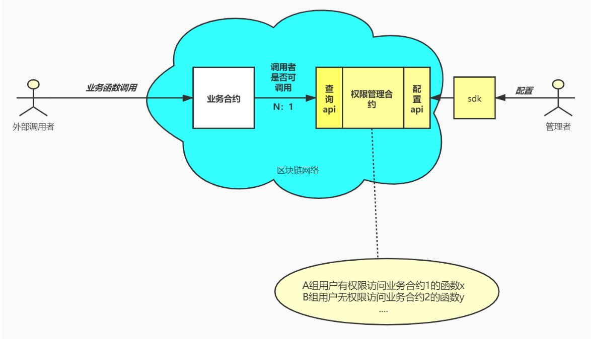

# 1. 概述
## 1.1. 背景
随着智能合约业务日益丰富，越来越多的合约需要引入权限控制。如果不对智能合约做权限控制，那么无法满足业务的安全性要求。例如，存证场景中，除了上传存证的函数外，还有许多专供审核人员调用的函数，这些函数应仅由审核人员来使用，如果这些函数没有正确设置权限拦截逻辑，整套逻辑就会被攻击者轻易操控。

权限治理组件的目的在于为智能合约开发者提供权限控制功能。开发者只要添加少量代码，即可拦截非法调用。同时，有一个专门的权限治理合约用于治理各个业务合约的拦截规则，对规则的修改只需操作权限治理合约，不需要调整业务合约，且修改会实时生效。

## 1.2. 适用场景
本权限治理组件适合基于组的权限治理需求。例如，假设现在要开发一个存证智能合约，要求其中某些函数仅能由审查员来调用。这时，到权限治理合约配置“审查员”组，并设置这些函数仅由审查员访问，配置完成后，当审查员之外的账户在调用这些函数的时候，都会被拦截掉。

## 1.3. 特性
权限治理组件的特性如下：
- 权限配置粒度为函数级别
- 权限配置基于组
- 权限配置修改实时生效
- 对业务方的侵入性小
- 权限治理合约包含多种治理规则

## 1.4. 前提
本组件适用于对智能合约开发有一定了解的人员。如果您还对智能合约开发缺乏了解，建议参考这套智能合约开发教程： [智能合约开发教程](https://mp.weixin.qq.com/s?__biz=MzA3MTI5Njg4Mw==&mid=2247485581&idx=1&sn=6a0b62212d35cb25903227e422adc4c5&scene=19#wechat_redirect)

# 2. 整体结构

权限治理组件的整体结构如下图所示。权限治理合约预先由治理者部署在区块链上，它治理一组业务合约的权限配置，主要定义哪些账户（组）可以访问业务合约的哪些函数，治理者可以通过sdk或者控制台修改权限配置。当业务合约收到调用某函数的请求时，会通过权限治理合约的查询api询问当前调用者是否可以调用该函数，进而拦截非法的访问。




例如，治理员在权限治理合约中设置"alice不得访问HelloWorld合约的hello函数"，那么当alice去调用HelloWorld合约的hello函数时，hello函数去权限合约查看alice的权限，发现不能访问，于是这次对hello的调用就会被拦截；反之，假如bob调用HelloWorld合约的hello函数时，hello函数去权限合约查看bob的权限，发现bob可以访问，所以就会允许bob继续调用后面的逻辑。

# 3. 快速开始
权限组件的使用者包括两个角色：治理方和业务方。治理方负责权限合约的部署、配置；业务方负责接入权限合约、拦截非法调用。这一节提供一个简单但完整的示例，以让您了解整个组件的使用流程。这一节的内容包括：

- 【治理方】部署权限合约
- 【业务方】编写一个基于权限组件的HelloWorld合约，并部署
- 【治理方】对HelloWorld合约的权限进行配置
- 【业务方】权限验证

此外，操作权限合约可以通过控制台，或者后文的sdk调用的方式。本节操作示例使用了FISCO BCOS控制台作为客户端来部署合约。如果您对控制台的操作不熟悉，建议参考[FISCO BCOS控制台教程](https://fisco-bcos-documentation.readthedocs.io/zh_CN/latest/docs/installation.html#id7)。

## 3.1. 权限合约部署
在开始修改业务方代码前，需要先部署权限合约。一个权限合约通常是一次性的，因为它可以治理许多业务合约的权限。
### 3.1.1. 合约下载
通过git下载源码，获取智能合约
```
git clone https://gitee.com/yuzhichu/auth-manager
cd auth-manager/src/main/contracts
```
### 3.1.2. 启动控制台
现在我们将所有合约代码（即上文auth-manager/src/main/contracts目录中的所有代码）拷贝到控制台的contracts/solidity目录下。

生成两个控制台身份
```
bash getAccount.sh
bash getAccount.sh
```
该身份会以pem形式保存在控制台的accounts目录下。我们将第一个身份称为“治理员身份”，用于操作权限合约；第二个身份称为“测试账户”，用于调用HelloWorld合约。以治理员身份启动控制台：
```
bash start.sh 1 -pem [治理员pem文件，如accounts/xxx.pem]
```

### 3.1.3. 部署权限合约
启动控制台后，下一步就可以部署权限合约了。
```
[group:1]> deploy AuthManager 1 [,] [,] 0
contact address:[权限合约地址]
```
这里面AuthManager是权限治理合约。部署它的时候会传入一组与运行模式有关的参数，按上面填写即可。部署成功后，会返回"contract address"字样和权限合约地址。部署后，仅有治理员身份可以操作该权限合约。

## 3.2. 业务合约引入
在治理方部署了权限治理合约后，业务方现在需要将权限治理合约引入自己的智能合约。
### 3.2.1. 引入权限组件
现在我们写有一个HelloWorld智能合约，它的代码如下：
```
pragma solidity ^0.4.25;

contract HelloWorld{
    
    event Hello();
    function hello() public {
        emit Hello();
    }    
    
}
```
接下来像3.1.1节中那样下载智能合约文件，智能合约文件有很多，但作为业务方我们只需要关心IAuthControl。引入它后，则HelloWorld变为：
```
pragma solidity ^0.4.25;

import "./IAuthControl.sol";
contract HelloWorld{
    IAuthManager private _authManager;
    constructor(IAuthControl authManager){
        _authManager = authManager;
    }
    
    event Hello();
    function hello() public {
        require(_authManager.canCallFunction(address(this), msg.sig, msg.sender));
        emit Hello();
    }    
}
```
这里面引入可以分为三步：
- 第一步，导入IAuthControl.sol文件（第3行import）
- 第二步，在构造方法中引入权限治理合约的地址（第5到第8行）
- 第三步，在业务函数中引入权限治理合约的权限判断逻辑（第12行canCallFunction）。

其中，为canCallFunction传入了三个参数，表示向权限合约询问“当前调用者是否有权限调用当前合约的当前函数”。通常，业务方在调用canCallFunction时，只需固定按此写法传参即可，这三个变量已经代表了当前的执行环境。它们含义分别为：

- address(this)：表示当前HelloWorld合约部署后的地址
- msg.sig：当前函数（本例中为hello）的函数签名。
- msg.sender表示当前函数的调用者。

### 3.2.2. HelloWorld合约部署
将HelloWorld.sol拷贝到控制台contracts/solidity目录下。启动控制台并部署HelloWorld合约：
```
bash start.sh 
[group:1]> deploy HelloWorld [权限合约地址]
contact address: [HelloWorld合约地址]
```

其中，构造函数传入的是权限合约地址，这个地址是3.1.3节中权限合约部署后的地址。

至此，业务方的接入工作已经完成，但现在部署后权限还没有起到效果，因为需要治理方在权限合约中进行权限规则配置。

### 3.3. 权限规则配置
现在以治理方的身份启动控制台，以便操作权限治理合约：
```
bash start.sh 1 -pem [治理员pem文件，如accounts/xxx.pem]
```

由于权限治理合约是基于组的，需要先创立一个组，该组命名为exampleGroup，参数1表示这个组是白名单组(如果您想了解更多关于组的设计，请参考后文4.1.2节):
```
[group:1]> call AuthManager [权限合约地址] createGroup "exampleGroup" 1
```
随后，将测试账户添加到该组：
```
[group:1]> call AuthManager [权限合约地址] addAccountToGroup [测试账号的账户地址] "exampleGroup"
```

最后，关联函数和组，这样只有该组允许访问此函数：
```
[group:1]> call AuthManager [权限合约地址] addFunctionToGroup [HelloWorld合约地址] [hello函数签名] "exampleGroup"
```
其中，HelloWorld合约地址是3.2.2节中部署HelloWorld合约后的地址；hello函数是指函数签名字符串，这个例子中传入"hello()"。关于函数签名的知识，可参考6.2节。

经过如此配置后，则仅有白名单内的账户有权限访问对应的函数。

### 3.4. 验证
当权限规则配置完毕，这个时候对HelloWorld的非法访问就会被拦截。例如以随机的身份启动控制台：
```
bash start.sh
[group:1]> call HelloWorld [HelloWorld合约地址] hello
The execution of the contact rolled back.
```
这个时候，由于该身份不在白名单内，访问就会报错。但如果以白名单组员的身份来调用HelloWorld，就可以成功：
```
bash start.sh 1 -pem [测试账号pem文件，如accounts/xxx.pem]
[group:1]> call HelloWorld [HelloWorld合约地址] hello
0x21dca087cb3e44f44f9b882071ec6ecfcb500361cad36a52d39900ea359d0895
```


# 4. 治理手册

这一节主要讲解如何治理权限合约。如果您是业务方，无需阅读接下来的内容；如果您是治理方，想了解如何部署权限合约、配置权限规则，则需要继续阅读本节。 

## 4.1 关键概念

### 4.1.1 业务合约与权限合约

权限治理涉及的合约分为两类：业务合约、权限合约。

- 业务合约是用户自己开发的合约，不属于本组件。业务合约通过访问权限合约的canCallFunctoin函数来拦截非法调用。
- 权限合约是本组件提供的AuthManager合约，用于配置哪些账户可以访问哪些合约的哪些函数。可以治理多个业务合的权限。

### 4.1.2 组
组定义了哪些账户可以访问哪些函数。组包含的信息如下：

- 账户列表
- 模式。包含两个可选择的模式：
    * 黑名单模式
    * 白名单模式
- 函数列表

通过上面的配置，即可确定哪些账户可以访问哪些函数:
- 配置了一个黑名单组，意味着仅组内账户不能访问这些函数
- 配置了一个白名单组，意味着仅组内账户可以访问这些函数

### 4.1.3 治理模式
权限治理合约有两种模式：治理员模式、委员会模式

- 治理员模式下，由单一治理员修改组配置； 还可以转让治理员权限。
- 委员会模式下，所有操作均通过投票进行。委员会成员可以修改组配置。还可以修改委员会列表、投票规则等。

一个权限治理合约的模式在部署时即确定，一旦确定一种模式，就无法更改。

### 4.1.4 投票模式
投票包含两种规则：多签模式和阈值权重模式。

- 多签模式下，当投票数达到最小签名数时，投票即通过。
- 阈值权重模式下，每个委员均配有对应的权重，当已投票的总权重达到最小阈值时，投票即通过。

多签是阈值权重模式下的一个特例，即所有委员会的权重为1。


# 5. AuthManager合约接口列表
- 合约部署

合约部署时需要决定是治理员模式还是治理委员会模式。以下为治理员模式下权限配置接口：
- createGroup 创建组
- addAccountToGroup 将账户添加到组
- addFunctionToGroup 将合约函数关联到组
- removeAccountFromGroup 将账户从组内移除
- removeFunctionFromGroup 将合约函数与组的关联取消

以下为治理委员会模式下的权限配置接口：
- requestCreateGroup 请求创建组
- requestAddAccountToGroup 请求将账户添加到组
- requestAddFunctionToGroup 请求将合约函数关联到组
- requestRemoveAccountFromGroup 请求将账户从组内移除
- requestRemoveFunctionFromGroup 请求将合约函数与组的关联取消
- approveSingle 投票请求
- deleteSingle 删除请求
- getRequestSingle 查看请求
- executeCreateGroup 创建组
- executeAddAccountToGroup 执行将账户添加到组
- executeAddFunctionToGroup 执行将合约函数关联到组
- executeRemoveAccountFromGroup 执行将账户从组内移除
- executeRemoveFunctionFromGroup 执行将合约函数与组的关联取消

以下为通用的查询接口
- containsAccount
- containsFunction
- getGroup
- canCallFunction

以下为治理员模式下的治理接口：
- transferAdminAuth
- isAdmin

以下是治理委员会模式下的治理接口：
- requestSetThreshold
- requestResetGovernors
- executeSetThreshold
- executeResetGovernors
- requestAddGovernor
- deleteAddGovernorReq
- approveAddGovernorReq
- getGovernorsToAdd
- executeAddGovernorReq
- requestRemoveGovernor
- deleteRemoveGovernorReq
- approveRemoveGovernorReq
- getGovernorsToRemove
- executeRemoveGovernorReq

## 5.1. 合约部署

说明：部署权限治理合约AuthManager。

参数说明：
- uint mode：1-治理员模式，2-治理委员会模式。如果选择治理员模式，则当前账户为治理员。
- address[] accounts: 初始的治理委员会列表。仅mode为2时有效，如果mode为1，则本参数传空数组即可。
- uint16[] weights: 初始治理委员会权重。仅mode为2时有效，如果mode为1，则本参数传空数组即可。
- uint16 threshold: 投票有效的最小权重。仅mode为2时有效，如果mode为1，则本参数传0即可。

示例1：部署治理员模式下的权限治理合约。后面三个参数如本例一样传空即可。

```
deploy AuthManager 1 [,] [,] 0
```

示例2：部署委员会模式的权限治理合约，并且采用多签投票方式。比如委员会包含三个地址，分别为"0x1","0x2","0x3"，要求至少3票投票才能通过，则部署方式为：

```
deploy AuthManager 2 ["0x1", "0x2", "0x3"] [1,1,1] 3 
```

这里[1,1,1]表示每个委员权重为1。

示例3：部署委员会方式的权限治理合约，并且采用基于阈值投票方式。比如委员会包含三个地址，分别为"0x1","0x2","0x3"，权重分别为1，2，3。要求总权重为4，投票才算有效。则部署方式为：

```
deploy AuthManager 2 ["0x1","0x2", "0x3"] [1,2,3] 4
```

## 5.2. createGroup

说明：创建一个组。

调用要求：当前调用者为治理员。该组必须存在。

参数说明：
- string group: 组名
- uint8 mode：组是黑名单还是白名单。1-白名单，2-黑名单

## 5.3. addAccountToGroup

说明：将账户地址拉入到组中。

调用要求：要求当前调用者为治理员。要求组已被创建，且账户尚未在这个组中。

参数说明：
- address account: 账户地址
- string group: 组名

## 5.4. addFunctionToGroup

说明：将某合约的某函数关联到组中。调用后，若当前组为白名单组，则仅有组内账户可以访问该函数；若当前组为黑名单组，则仅有组内账户不允许访问该函数。

调用要求：当前调用者为治理员。要求组已被创建，且函数未被关联到任何组中（无论是本组，还是其他组）

参数说明：
- address contractAddr: 业务合约地址
- string func: 业务合约中待关联函数的签名字符串，如"add(uint256,uint256)","hello()"等。
- string group: 组名

## 5.5. removeAccountFromGroup

说明：将账户地址从组中移除。

调用要求：当前调用者为治理员。要求组已被创建，且账户在这个组中。

参数说明：
- address account: 账户地址
- string group: 组名

## 5.6. removeFunctionFromGroup

说明：取消某合约某函数与组的关联。

调用要求：当前调用者为治理员。要求组已被创建，且函数已被关联到组。

参数说明：
- address contractAddr: 业务合约地址
- string func: 业务合约中待关联函数的签名字符串，如"add(uint256,uint256)","hello()"等。
- string group: 组名

## 5.7. requestCreateGroup

说明：请求创建一个组。只能同时存在一个同类请求。参数会被缓存，直到请求被执行或删除。

调用要求：当前调用者为治理委员会成员；不存在其他未关闭的同类请求。

参数说明：
- string group: 组名
- uint8 mode：组是黑名单还是白名单。1-白名单，2-黑名单

## 5.8. requestAddAccountToGroup

说明：请求将账户添加到组。只能同时存在一个同类请求。参数会被缓存，直到请求被执行或删除。

调用要求：当前调用者为治理委员会成员；不存在其他未关闭的同类请求。

参数说明：
- address account: 账户地址
- string group: 组名

## 5.9. requestAddFunctionToGroup

说明：请求将函数关联到组。只能同时存在一个同类请求。参数会被缓存，直到请求被执行或删除。

调用要求：当前调用者为治理委员会成员；不存在其他未关闭的同类请求。

参数说明：
- address contractAddr: 业务合约地址
- string func: 业务合约中待关联函数的签名字符串，如"add(uint256,uint256)","hello()"等。
- string group: 组名

## 5.10. requestRemoveAccountFromGrop

说明：请求将账户地址从组中移除。只能同时存在一个同类请求。参数会被缓存，直到请求被执行或删除。

调用要求：当前调用者为治理委员会成员；不存在其他未关闭的同类请求。

参数说明：
- address account: 账户地址
- string group: 组名

## 5.11. requestRemoveFunctionFromGroup

说明：请求取消某合约某函数与组的关联。只能同时存在一个同类请求。参数会被缓存，直到请求被执行或删除。

调用要求：当前调用者为治理委员会成员；不存在其他未关闭的同类请求。

参数说明：
- address contractAddr: 业务合约地址
- string func: 业务合约中待关联函数的签名字符串，如"add(uint256,uint256)","hello()"等。
- string group: 组名

## 5.12. approveSingle

说明：对某个提案进行投票。

调用要求：当前调用者为治理委员会成员；投票还未关闭。

参数说明：
- uint8 txType：请求类型。见《请求类型列表》一节。

## 5.13. deleteSingle

说明：删除某个提案。

调用要求：当前调用者为治理委员会成员；投票还未关闭。

参数说明：
- uint8 txType：请求类型。见《请求类型列表》一节。

## 5.14. getRequestSingle

说明：获取某个未关闭的投票信息。

调用要求：投票还未关闭。

参数说明：
- uint8 txType：请求类型。见《请求类型列表》一节。

返回值：
- uint256：请求id（可以忽略）
- address：请求的发起地址
- uint256：请求的投票总阈值
- address：（可以忽略）
- uint256：目前投票的总权重
- uint8：请求类型。见《请求类型列表》一节。
- uint8：（可以忽略）


## 5.15. executeCreateGroup

说明：执行创建组。

调用要求：当前调用者为治理委员会成员；请求已被投票通过。

## 5.16. executeAddAccountToGroup

说明：执行将账户添加到组的请求。

调用要求：当前调用者为治理委员会成员；请求已被投票通过。

## 5.17. executeAddFunctionToGroup

说明：执行将业务函数关联到组的请求。

调用要求：当前调用者为治理委员会成员；请求已被投票通过。

## 5.18. executeRemoveAccountFromGroup

说明：执行将账户从组中移除的请求。

调用要求：当前调用者为治理委员会成员；请求已被投票通过。

## 5.19. executeRemoveFunctionFromGroup

说明：执行取消业务函数和组关联的请求。

调用要求：当前调用者为治理委员会成员；请求已被投票通过。

## 5.20. containsAccount

说明：查询某一账户是否位于某一组中。

调用要求：无

参数说明：
- string group:组名
- address account：账户

## 5.21. containsFunction

说明：查询某一合约函数是否已关联到组。

调用要求：无

参数说明：
- string group：组名
- address contractAddr：业务合约地址
- string func:业务合约中待关联函数的签名字符串，如"add(uint256,uint256)","hello()"等。

## 5.22. getGroup

说明：查询某一个组的信息

调用要求：无

参数说明：
- string group:组名

返回值说明：
- uint8：组的模式。1-白名单，2-黑名单
- uint256：组包含的账户数目
- uint256：组关联的函数数目

## 5.23. canCallFunction

说明：查询某一账户是否有权限调用某一合约函数

调用要求：无

参数说明：
- address contractAddr：业务合约地址
- bytes4 sig：业务函数的签名字节，由sha3(函数签名字符串)的前4字节得来。和msg.sig一致。
- address caller：调用者

## 5.24. transferAdminAuth

说明：转移治理员权限给另一个账户。

调用要求：当前调用者为治理员。

参数说明：
- address newAdminAddr：新治理员的账户地址。

## 5.25. isAdmin

说明：判断当前调用者是否为合约治理员。

调用要求：无


## 5.26. requestSetThreshold

说明：请求重设投票权重阈值。只能同时存在一个同类请求。参数会被缓存，直到请求被执行或删除。

调用要求：当前调用者为治理委员会成员；不存在其他未关闭的同类请求。

参数说明：
- uint16 newThreshold：新的权重阈值


## 5.27. requestResetGovernors

说明：请求重设治理委员会列表与权重。只能同时存在一个同类请求。参数会被缓存，直到请求被执行或删除。

调用要求：当前调用者为治理委员会成员；不存在其他未关闭的同类请求。

参数说明：
- address[] governors: 新的治理委员会名单
- uint16[] weights: 新的治理委员会对应权重

 ## 5.28. executeSetThreshold

说明：执行重设阈值请求

调用要求：当前调用者为治理委员会成员；请求已被投票通过。

 ## 5.29. executeResetGovernAccounts

说明：执行重设治理委员会列表请求

调用要求：当前调用者为治理委员会成员；请求已被投票通过。

## 5.30. requestAddGovernor

说明：请求向治理委员会中添加一个成员

调用要求：当前调用者为治理委员会成员；待添加账户还未没有过相关添加请求

参数说明：
- address account: 待添加成员

## 5.31. deleteAddGovernorReq

说明：删除添加治理委员会成员请求

调用要求：当前调用者为治理委员会成员；待添加账户已经生成了添加请求

参数说明：
- address account: 待添加成员

## 5.32. approveAddGovernorReq

说明：同意添加治理委员会

调用要求：当前调用者为治理委员会成员；待添加账户已经生成了添加请求

参数说明：
- address account: 待添加成员

## 5.33. getGovernorsToAdd

说明：取得所有待添加成员

返回值：
- address[]: 所有待添加的成员名单

## 5.34. executeAddGovernorReq

说明：执行请求

调用要求：当前调用者为治理委员会成员；待添加账户已经生成了添加请求

## 5.35. requestRemoveGovernor

说明：请求从治理委员会中删除一个成员

调用要求：当前调用者为治理委员会成员；待移除账户还未没有过相关移除请求

参数说明：
- address account: 待移除成员

## 5.36. deleteRemoveGovernorReq

说明：删除删除治理委员会成员请求

调用要求：当前调用者为治理委员会成员；待移除账户已经生成了移除请求

参数说明：
- address account: 待移除成员

## 5.37. approveRemoveGovernorReq

说明：同意删除治理委员会成员

调用要求：当前调用者为治理委员会成员；待移除账户已经生成了移除请求

参数说明：
- address account: 待移除成员

## 5.38. getGovernorsToRemove

说明：取得所有待删除成员

返回值：
- address[]: 所有待移除的成员名单

## 5.39. executeAddGovernorReq

说明：执行请求

调用要求：当前调用者为治理委员会成员；待添加账户已经生成了添加请求

# 6. 常量表

## 6.1. 组相关
- 白名单组：1
- 黑名单组：2

## 6.2. 请求类型相关

- 重设投票阈值：1
- 重设治理委员会列表：2
- 创建组：3
- 添加账户到组：4
- 关联函数到组：5
- 组内移除函数：6
- 取消函数和组关联：7

# 7. 集成javaSdk
在第3节的示例中，我们以控制台来操作部署、操作权限合约。除了控制台外，本组件也支持通过java代码来执行这些操作。推荐使用集成SDK的方式来进行权限治理，这样可以在没有控制台的情况下进行权限合约调用。

## 7.1. 依赖说明

如果治理方要集成权限组件sdk，需要的依赖如下：

| 依赖        | 版本     |
| --------   | -----:   |
| jdk    | jdk8u51+ |  
| gradle    | 5.6.4+ |   
| fisco-bcos | 2.2.2+ |

## 7.2. 源码下载

先前章节中，已经通过git下载了源码：
```
git clone https://gitee.com/yuzhichu/auth-manager
cd auth-manager
```

这个源码包含：
- 权限治理合约
- 权限治理的java sdk

## 7.3. 编译

方式一：如果服务器已安装Gradle

```
gradle build -x test
```

方式二：如果服务器未安装Gradle，则使用gradlew编译。Linux环境：gradlew。Windows环境：gradlew.bat。
以Linux环境为例：
```
chmod +x ./gradlew && ./gradlew build -x test
```

编译过后，得到jar包：dist/auth-manager.jar。

## 7.4 集成
在编译好该jar包后，将它引入到一个示例项目中进行调用，以操作权限合约。

### 7.4.1 新建springboot项目

可以通过 https://start.spring.io/ 等方式来新建一个springboot项目。

### 7.4.2 引入auth-manager sdk

前文中，编译auth-manager项目后得到了dist\auth-manager.jar。可以将auth-manager.jar导入到自己的项目中，例如拷贝到libs目录下，然后进行依赖配置，再对自己的项目进行编译。推荐gradle配置如下，

```
repositories {
    maven { url "http://maven.aliyun.com/nexus/content/groups/public/"}
    maven { url "https://oss.sonatype.org/content/repositories/snapshots" }
    maven { url "https://dl.bintray.com/ethereum/maven/" }
    mavenLocal()
    mavenCentral()
}

dependencies {
    implementation 'org.springframework.boot:spring-boot-starter-web'
    testCompile('org.springframework.boot:spring-boot-starter-test') {
        exclude group: 'org.junit.vintage', module: 'junit-vintage-engine'
        //exclude group: 'junit', module: 'junit'
    }
    compile ('org.fisco-bcos:web3sdk:2.2.2')
    compile fileTree(dir:'libs',include:['*.jar'])
}
```

### 7.4.3 配置

从控制台拷贝如下几个文件到业务工程的main/resources目录下：

- conf/ca.crt, conf/node.key, conf/node.crt

拷贝后，业务系统main/resources目录应为如下结构：

```
resources
 - ca.crt
 - node.crt
 - node.key
 - application.properties
```

配置application.properties：

```
### chain
# 机构名
system.orgId=jigou
# 节点连接字符串
system.nodeStr=[节点连接字符串]
# 群组id
system.groupId=1
# 加密方式，0-ECC， 1-国密
system.encryptType=0

## 私钥，请更换为对应16进制私钥，不要以0x前缀
system.privateKey=
```
### 7.4.4 使用方式示例

本例在单元测试中完成调用示例。首先新建DemoTest类，并通过Spring自动注入得到AuthManagerFactory:

```
@SpringBootTest
public class DemoTest {

    @Autowired
    private AuthManagerFactory factory;

    @Test
    public void test() throws Exception{
        //TODO     
    }
}
```

接下来设置黑名单，将一个账户拉黑，使得它无法调用hello函数。

```
@Test
public void demo() throws Exception{
    //创建权限合约
    AuthManager authManager = factory.createAdmin();
    //创建治理员调用接口
    AuthByAdminService authByAdminService = new AuthByAdminService(authManager);
    //创建组
    String group = "badGroup";
    authByAdminService.createGroup(group, AuthConstants.ACL_BLACKLIST_MODE);
    String blackAccount = "[待拉黑账户]";
    authByAdminService.addAccountToGroup(blackAccount, group);
    //配置组权限
    String bizContractAddress = "[HelloWorld合约地址]";
    String function = "[hello函数签名]";
    authByAdminService.addFunctionToGroup(bizContractAddress, function, group);
    //验证
    boolean canCall = authByAdminService.canCallFunction(bizContractAddress, function, blackAccount);
    Assert.assertFalse(canCall);
}
```

# 8. 常见问题

## 8.1. jvm崩溃

现象：

```

#
# A fatal error has been detected by the Java Runtime Environment:
#
#  Internal Error (sharedRuntime.cpp:834), pid=17781, tid=140031174805248
#  fatal error: exception happened outside interpreter, nmethods and vtable stubs at pc 0x00007f5c1d05406f
#
# JRE version: Java(TM) SE Runtime Environment (8.0_45-b14) (build 1.8.0_45-b14)
# Java VM: Java HotSpot(TM) 64-Bit Server VM (25.45-b02 mixed mode linux-amd64 compressed oops)
# Failed to write core dump. Core dumps have been disabled. To enable core dumping, try "ulimit -c unlimited" before starting Java again
#
# If you would like to submit a bug report, please visit:
#   http://bugreport.java.com/bugreport/crash.jsp
#

---------------  T H R E A D  ---------------

Current thread (0x00007f5bac160800):  JavaThread "nioEventLoopGroup-3-12" [_thread_in_Java, id=18017, stack(0x00007f5b8c5e8000,0x00007f5b8c6e9000)]

Stack: [0x00007f5b8c5e8000,0x00007f5b8c6e9000],  sp=0x00007f5b8c6e6150,  free space=1016k
Native frames: (J=compiled Java code, j=interpreted, Vv=VM code, C=native code)
V  [libjvm.so+0xaac99a]  VMError::report_and_die()+0x2ba
V  [libjvm.so+0x4f2de9]  report_fatal(char const*, int, char const*)+0x59
V  [libjvm.so+0x9ab5ba]  SharedRuntime::continuation_for_implicit_exception(JavaThread*, unsigned char*, SharedRuntime::ImplicitExceptionKind)+0x33a
V  [libjvm.so+0x914f1a]  JVM_handle_linux_signal+0x48a
V  [libjvm.so+0x90b493]  signalHandler(int, siginfo*, void*)+0x43
C  [libpthread.so.0+0xf100]
J 10415 C2 com.sun.crypto.provider.GCTR.doFinal([BII[BI)I (130 bytes) @ 0x00007f5c1e10c096 [0x00007f5c1e10be40+0x256]

```

这是jdk的bug，需要将jdk版本升级到jdk8u51版本。

## 8.2. 函数签名是什么

函数签名是函数的标识符，格式为“函数名(参数类型列表)”。例如，有下面这个solidity函数：
```
function add(uint256 a, uint256 b) public pure returns(uint256){}
```

那么它的函数签名为：
```
add(uint256,uint256)
```